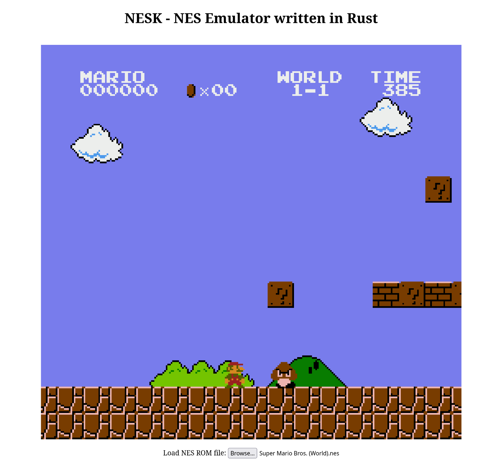

# NESK-WEB

This is the web-ui with which you can use NESK (an Emulator for the Nintendo Entertainment System).
You can view the page [here](https://nesk.sanjaykenn.com/).

The emulator is written in rust, which is compiled to WASM to be available in the browser.
You can find the full source code [here](https://github.com/sanjaykenn/nesk).



# How to run it
Since this is a static website, all you need to do is run

```
wasm-pack build --target web --out-dir public/pkg
```

in the project's root directory and then open index.html in your web browser.
If you get a CORS error, try creating a local server and opening the page from there.

Example:
```
cd public
python3 -m http.server
```